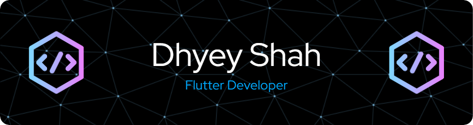

<!-- Header Image -->

  

<h1 align="center">Hi there 👋, I'm Dhyey Shah</h1>
<h3 align="center">🚀 Flutter Developer | 💻 Programmer | 🎨 Web Designer</h3>

---

## 👨‍💻 About Me
- 🔭 Currently working on **Logistics Solutions**
- 🌱 Actively learning **Flutter, DSA, and Firebase**
- 💬 Ask me about **Flutter Development, UI Design, Firebase, Kotlin/Java**
- ⚡ Fun Fact: I love to build clean, elegant UIs for my clients!
- 🎯 **Goal 2025**: Publish 2 apps on Google Play Store

---

## 🌐 Connect with Me

  
  
  

---

## 🛠️ Tech Stack & Tools

  
  
  
  
  
  
  

---

## 📈 GitHub Stats

  
  

  

---

## 🏆 Achievements & Certifications
- 🧠 **BhashaTHON '25 Winners**
- 🥇 **Google Cloud**: Innovating with AI Badge
- 👨‍💻 Participated in **DUHacks 4.0**
- 🔥 Completed **#geekstreak2024** (21 Days Coding Challenge)

---

## 🚀 Featured Projects

| Project Name | Description | Tech Stack |
|--------------|-------------|------------|
| **Ranjit Logistics** | Android-based logistics system with Azure DB | Java, Azure |
| **Chat App** | Real-time messaging app with media sharing & user profiles | Android, Firebase |
| **dTrans-SKL** | End-to-end logistics company solution | Flutter, Azure, Firebase |

---

## 🎉 Fun Corner
> _"Code is like humor. When you have to explain it, it’s bad."_ — **Cory House**

---

## 📬 Feedback & Suggestions
If you have any suggestions, collaboration ideas, or feedback, feel free to reach out via [email](mailto:dhyeyshah009@gmail.com). Let's build something awesome together!

---

  Built with ❤️ by <strong>Dhyey Shah</strong>

